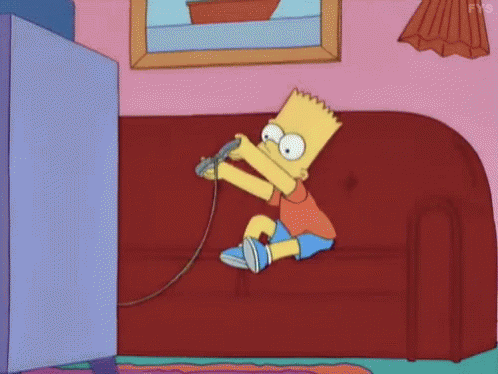

<h1 align="center">🎮 D.G.I 🎮</h1>

  </img>

  <strong>💻 A solução para os desenvolvedores idependentes 🖱️</strong> 
  <a href="https://sn0ci.sse.codesandbox.io">Acesse a D.G.I</a>

 

## :notebook: Sobre o Projeto
A D.G.I foi desenvolvida na matéria de TIAW, durante o 1° Período do curso de  Engenharia De Software na PUC-MG.
O projeto veio com uma proposta de trazer uma maior praticidade para os desenvolvedores idependentes que geralmente possuem pouco incentivo.

## :pushpin: Objetivos
O objetivo principal do trabalho é auxiliar na divulgação de jogos desenvolvidos por pequenas produtoras ou até mesmo programadores idependentes. Tal auxílio viria além da própria divulgaação do site ,através da possibilidade de feedback da comunidade, juntamente com a oportunidade de conseguir invetidores.

## :gear: Tecnologias Utilizadas

* HTML
* CSS
* JavaScript
* Node.js

## 🐆 Metodologias Ágeis

* Scrum

## 📖 Alunos integrantes da equipe

* Felipe Espíndola Valério
* Thiago Mariano
* Lucas de Paula Martins
